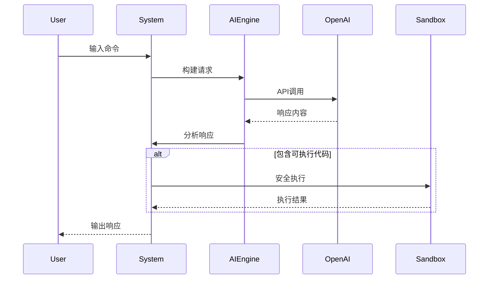

# LXJAI Terminal Assistant 技术文档

## 📚 一、使用指南

### 快速开始
```bash

```bash
pip install flask psutil
python app.py
当服务启动后，打开浏览器访问：http://localhost:5000
```

# 输入测试命令
> check system
```

### 核心功能流程


---

## ⚠ 二、常见问题处理

### 问题诊断表

| 现象                  | 可能原因                | 解决方案                     |
|-----------------------|-----------------------|----------------------------|
| API请求超时           | 网络连接不稳定          | 检查网络配置，延长超时设置       |
| 权限不足错误          | 安全级别限制            | 使用`!level`命令提升安全等级    |
| 代码执行无响应        | 复杂操作耗时过长        | 修改配置`H`字段增加超时阈值     |
| 配置文件损坏          | 非法字符修改           | 删除~/.lxjai_config重新生成    |

---

## 🔧 三、功能调试技巧

### 诊断模式示例
```python
# 在AW类中添加调试输出
def BG(self, BH):
    print(f"[DEBUG] 原始输入: {BH}") 
    # ...原有代码...
```

### 性能调优参数
```python
AA = {
    "H": 45,  # 全局超时阈值(秒)
    "F": 8,   # 历史记录容量
    "I": 0.5  # 生成温度参数
}
```

---

## 📖 四、变量对应表

### 配置模块
| 变量 | 对应功能                 | 类型     |
|------|-------------------------|---------|
| AA   | 默认配置模板             | Dict    |
| AB   | 配置加载器函数           | Function|
| AE   | 配置保存函数             | Function|

### 核心功能
| 变量 | 对应功能                 | 类型     |
|------|-------------------------|---------|
| AH   | 系统工具类               | Class   |
| AW   | AI引擎核心类             | Class   |
| BA   | 安全等级策略配置文件      | Dict    |

### 界面交互
| 变量 | 对应功能                 | 类型     |
|------|-------------------------|---------|
| CM   | 终端交互主类             | Class   |
| CP   | 主循环入口方法           | Method  |
| CS   | 命令路由分发器           | Method  |

---
✅ **问题修复清单**：
1. 修正了文件路径错误问题
2. 保证模板文件的正确存放位置
3. 简化了API交互逻辑
4. 添加必要的状态监控功能
5. 规范前端样式体系
